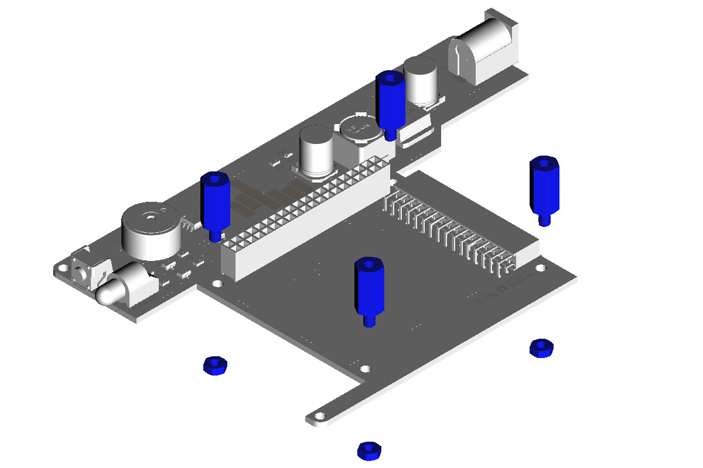
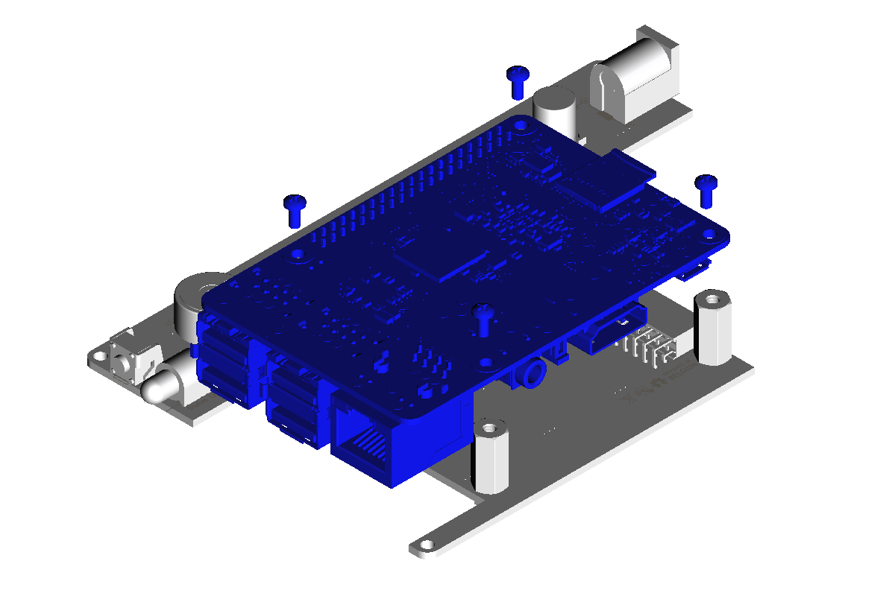
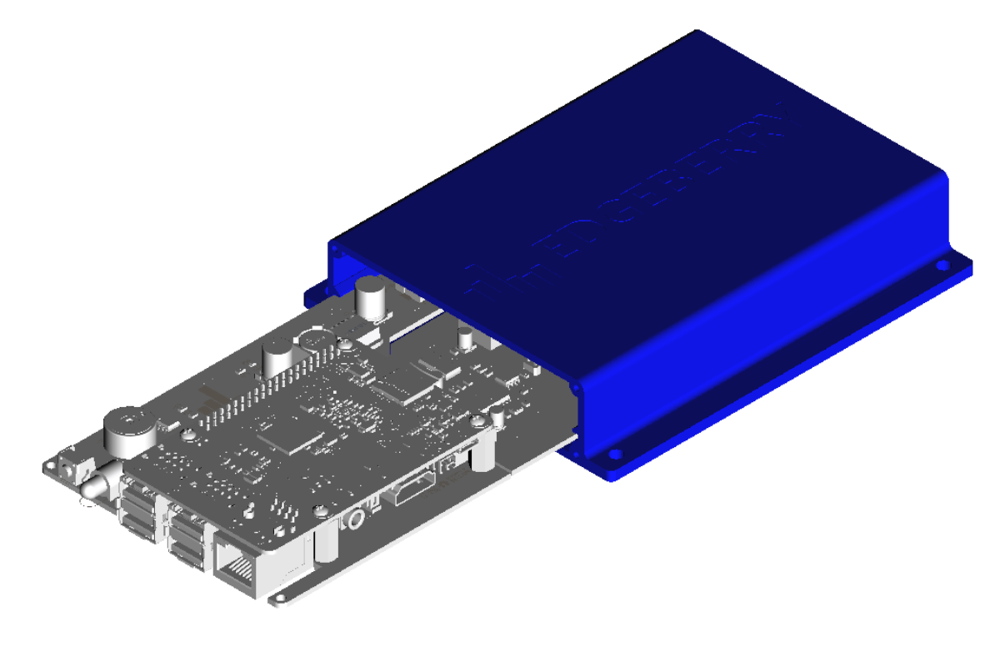
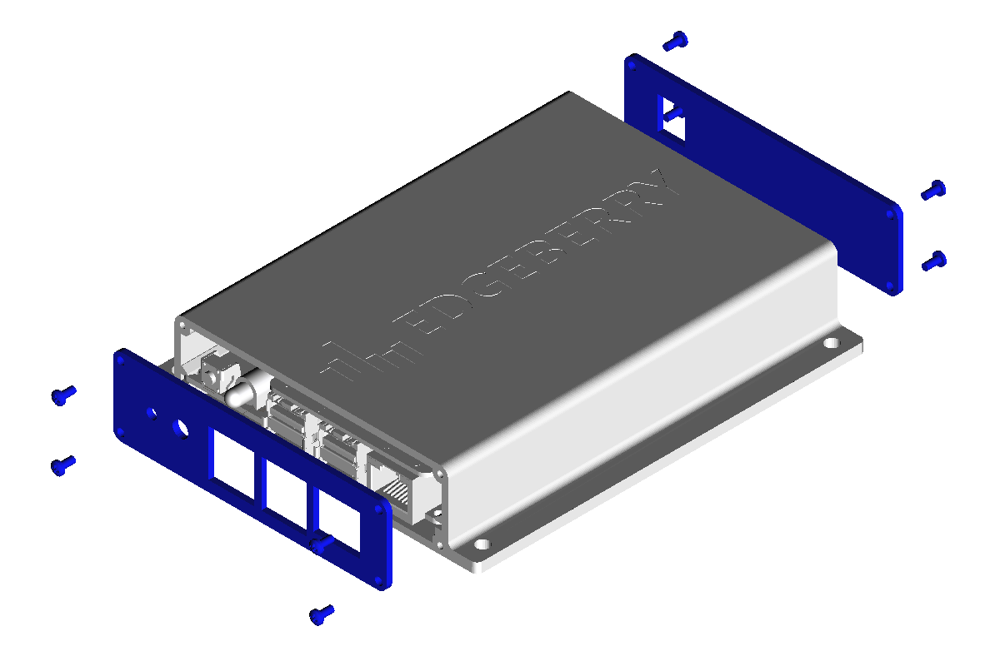
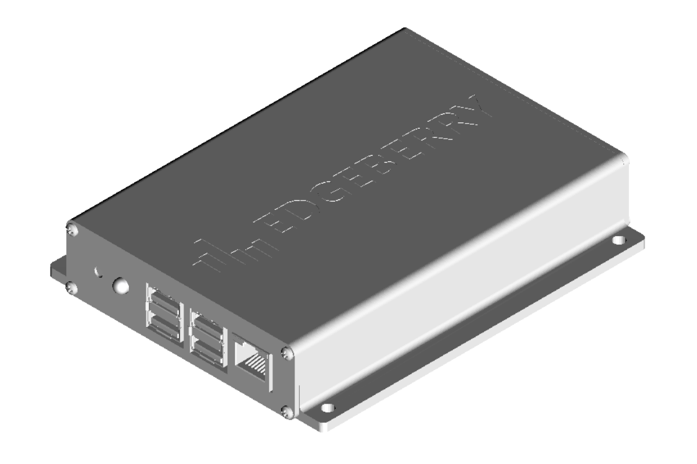

# Getting started
## Device Assembly
After obtaining the Edgeberry Hardware, and [3D printing the Edgeberry Enclosure](https://www.thingiverse.com/thing:6595172), you're ready to assemble your device.

<p float="left">
  
  
  
</p>
<p float="left">
</p>
<p float="left">
  
  
  
</p>

## Raspberry Pi SD-card
We'll run Raspberry Pi's 'lite' version of Linux/Debian on the device. We'll download the image from Raspberry Pi's website, and use the `Raspberry Pi Imager` tool for writing the image to the SD-card.

```
1) Download the most recent Raspberry Pi OS Lite image from Raspberry Pi's website
https://www.raspberrypi.com/software/operating-systems/
2) Download the Raspberry Pi Imager tool
https://www.raspberrypi.com/software/
```

Use the Raspberry Pi Imager tool to configure the settings:
```
1) Setup your wireless network
2) Change the username and password
3) Enable SSH (for remote access using SSH)
4) Change the hostname (e.g. 'Edgeberry')
```
And write the image to the SD-card. When this process is ready, put the SD-card in the Raspberry Pi and power up the device.

## Access using SSH
When your device has booted, you can now access your Edgeberry device by opening a command line and running:
```
ssh <your username>@<your device IP address>
```
<hr/>

# Edgeberry stuff

## Installing the Edgeberry Software
Now we have SSH access to our device, we can download and install the Edgeberry Device Software.
```
wget -O install.sh https://github.com/Edgeberry/Edgeberry/releases/latest/download/install.sh;
chmod +x ./install.sh;
sudo ./install.sh;
```
Note: several parts of the installation process may take a while with little to no feedback, just allow the installer to do its thing.

## Linking the device to your Edgeberry Dashboard account
Create an account and log in on the Edgeberry online device management dashboard
```
https://dashboard.edgeberry.io
```
On the devices page, click the "add device" button. In the next step your device's serial number will be asked. Get your device's serial number by executing following command on the device.
```
edgeberry --hardware-id
```
Make sure you have physical access to the button on the front of the device. In the next step you will be asked to press the button on your device to link this to your account. When this was successful, your device is now linked to your online device management dashboard.

# Application development

## Directly on the device

Using `Visual Studio Code`, we can remotely develop code on our Edgeberry device using the `Remote-SSH` extension:
```
1) Open VSCode
2) Navigate to 'Extensions' (Ctrl+Shift+x)
3) Search and install the 'Remote-SSH' extension
```
When the extension is installed, connect to the device
```
4) View > Command Palette... (Ctrl+Shift+p)
5) Remote-SSH: Connect to host...
6) <user>@<host>
7) <password>
```
The VSCode server is automatically installed. Now you can develop directly on the device.

## Python application
TODO: setting up the environment for python, using the Edgeberry Python SDK, ...
