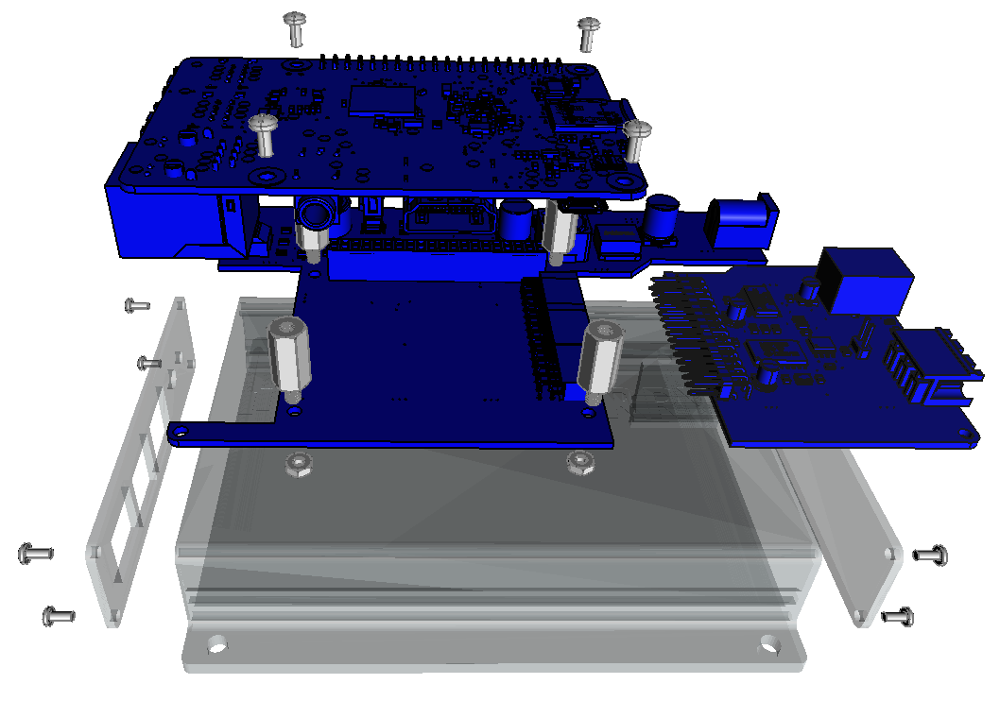

# The Edgeberry Project

**Internet of Things** is one of the most compelling frontiers in information technology; the domain where the digital realm converges with the physical world through interconnected devices equipped with sensors and actuators. This technology empowers data-driven decision making, streamlining of processes, enhanced monitoring capabilities, ... . Connected devices have boundless potential to reshape our world in ways limited only by our imagination and available technologies.

The **Edgeberry Project is a dynamic and integrated ecosystem that brings together hardware, software and community resources** to empower users and developers in the IoT space. With the Raspberry Pi (or compatible device) and Edgeberry Hardware at its core, the Edgeberry platform provides the foundation for building, deploying and managing IoT devices, offering a range of hardware configurations through Edgeberry Hardware Cartridges, software tools like the online device management platform Edgeberry Dashboard and publicly available development resources to support a diverse array of applications and use cases.

The Edgeberry Project is build on the beliefs that **collaboration, open innovation and the sharing of knowledge** are key drivers of collective progress. It is mostly build on the shoulders of open source giants (e.g. Linux, Raspberry Pi, ...) having openness in its roots. The Edgeberry Project aims to democratize the IoT edge and enable individuals and organizations to harness the transformative potential of IoT technology.

## Product overview

Lorem Ipsum some shiny pictures that clarify the shape and scope of the project

## Application
Whether you are a weathered engineer making a quick proof-of-concept for an IoT solution, or a student of the information technology arts dipping your toes in the shallow part of the connected devices pool. With the Edgeberry project you turn your favorite single-board computer into an IoT Edge device in the blink of a cursor! Leveraging the robust foundation of this trusted, open-source, and widely supported computing system, Edgeberry seamlessly integrates essential IoT functionalities allowing you to fully focus on bringing your IoT idea to life.
